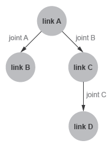

# Семинар №1. Знакомство с фреймворком программирования роботов ROS 2

## Задачи семинара:
 Теория
 - Познакомиться с назначением и основными возможностями фреймворка ROS2
 - Изучить базовые понятия и архитектуру фреймворка ROS2

 Практика
 - Освоить сборку и запуск готовых примеров приложений в ROS2
 - Освоить редактирование формата URDF

Данное руководство предоставляет краткую информацию, необходимую для выполнения задач семинара.

После прохождения семинара студенту необходимо составить отчет, в котором будет подробно изложена теоретическая  и практическая часть работы.

# Теория
ROS2 - фреймворк программирования систем управления роботов, являющийся второй версией самого популярного фреймворка программирования роботов ROS1.

Создаваемое с помощью ROS2 ПО представляет собой графоподобную структуру, где узлы (nodes) являются программами, которые выполняют решение независимых задач (захват изображения с камеры, прием данных с какого-либо сенсора, детекция обьектов на изображении, расчет одометрии и т.д.). Ребрами графа являются каналы (topics) передачи данных (messages) между узлами с фиксированным типом данных.


## Команды:
```
ros2 run <package_name> <executable_name>
ros2 node list
ros2 node info <node_name>
ros2 topic list
ros2 topic echo <topic_name>
ros2 topic info <topic_name>
ros2 topic hz <topic_name>
```
Подробнее о узлах:
https://docs.ros.org/en/humble/Tutorials/Understanding-ROS2-Nodes.html

Подробнее о топиках:
https://docs.ros.org/en/humble/Tutorials/Topics/Understanding-ROS2-Topics.html

### Дополнительно:
> Подробнее о сервисах: https://docs.ros.org/en/humble/Tutorials/Services/Understanding-ROS2-Services.html
>
> Подробнее о параметрах: https://docs.ros.org/en/humble/Tutorials/Parameters/Understanding-ROS2-Parameters.html
>
> Подробнее о экшенах: https://docs.ros.org/en/humble/Tutorials/Understanding-ROS2-Actions.html

## Универсальный формат описания роботов `URDF`

URDF, является спецификацией XML, используемой в академической среде и промышленности для моделирования систем мультител, таких как руки роботов-манипуляторов, гуманоидных роботов, мобильных колесных и гусеничных роботов и т.д.. URDF особенно популярен у пользователей ROS.

Модель робота описывается xml файлом с расширением .urdf. Формат позволяет описывать древовидную структуру робота состоящего из xml элементов `<link>` и `<joint>`, где link описывает тело, а joint кинематическую связь между телами.



Например, типичная структура файла urdf для структуры робота на рисунке выше:
```xml
<robot name = "linkage">
    <link name = "joint A">
		...
	</link>
    <link name = "joint B">
		...
	</link>
    <link name = "joint C">
		...
	</link>
    <link name = "joint D">
		...
	</link>
	<joint name = "joint A">
		<parent link = "link A" />
		<child link = "link B" />
	</joint>
	<joint name = "joint B">
		<parent link = "link A" />
		<child link = "link C" />
	</joint>
	<joint name = "joint C">
		<parent link = "link C" />
		<child link = "link D" />
	</joint>
	<joint name = "joint D">
		<parent link = "link B" />
		<child link = "link D" />
	</joint>
</robot>
```

При этом, каждый link обычно содержит элементы `<inertial>`, `<visual>`, `<collision>`:
```xml
<link>
    <inertial>
        ...
    </inertial>
    <visual>
        <geometry>
            ...
        </geometry>
        <material>
            <color />
        </material>
    </visual>
</link>
```

`<visual>` определеяет внешний вид описываемого тела,

`<inertial>` определяет инерцию (моменты инерции),

`<collision>` позволяет описать столкновения с телом (коллизии).


### Источники:
- https://wiki.ros.org/urdf/Tutorials
- https://docs.exponenta.ru/physmod/sm/ug/urdf-model-import.html

# Практическая часть работы:

## Задание №1. Знакомство с консольными командами ROS 2.

На примере стандартного пакета __demo_nodes_cpp__ и приложений __talker__ и __listener__ запустить команды (см. Команды). Описать что делает каждая команда. Приложить в отчете вывод каждой команды.

> Команду `ros2 run` для __talker__ и __listener__ запускать в отдельных терминалах. Остальные команды, запускать в третьем терминале. Обьяснить в отчете, зачем это делать? Название топика (<topic_name>) узнать с помощью одной из этих команд.


## Задание №2. Turtlesim (робот черепаха 2d)
https://docs.ros.org/en/humble/Tutorials/Beginner-CLI-Tools/Introducing-Turtlesim/Introducing-Turtlesim.html

Запуск черепашки:

```bash
ros2 run turtlesim turtlesim_node
```

Управление черепашкой (открыть в другом терминале):
```bash
ros2 run turtlesim turtle_teleop_key
```

Изучение средств разработчика RQt. Запустить в еще одном терминале:
```bash
rqt
```

В открывшемся окне изучить меню plugins. Открыть плагин node_graph, что вы видите? Запишите в отчет.

В отчете отразить как именно происходит управление черепашкой. Перечислить список узлов, топиков. Описать какой узел что делает, какие данные отправляет и принимает. Приложить скриншот rqt_graph (запуск с помощью `ros2 run rqt_graph rqt_graph` или из `rqt`)

## Задание №3. Универсальный формат описания роботов (URDF). Робот R2D2.

https://docs.ros.org/en/humble/Tutorials/Intermediate/URDF/Using-URDF-with-Robot-State-Publisher.html

Перейти в папку заранее созданного рабочего окружения:

```bash
cd ~/ros2_seminars_ws
```
Вывести, с помощью команды `ls`, какие папки находятся в __ros2_seminars_ws__

Запустить демонстрационное приложение

```bash
ros2 launch urdf_tutorial demo.launch.py
```

В отдельном терминале запустить:
```bash
rviz2 -d ~/ros2_seminars_ws/install/urdf_tutorial/share/urdf_tutorial/r2d2.rviz
```

Изучить URDF файл робота R2D2.
Файл находится по адресу
`~/ros2_seminars_ws/src/ros2-urdf-tutorial/urdf_tutorial/urdf/r2d2.urdf.xml`.

В отчете перечислить (названия) из каких тел состоит робот, какие свойства у этих тел. Какими связями они соединены (какие типы связей используются и почему).

# Индивидуальные задания

Внести изменения в модель робота R2D2 в соответсвествии с индивидуальным заданием преподавателя (`~/ros2_seminars_ws/src/ros2-urdf-tutorial/urdf_tutorial/urdf/r2d2.urdf.xml`).

На оценку отлично, по заданию преподавателя внести изменения в закон движения в файле `~/ros2_seminars_ws/src/ros2-urdf-tutorial/urdf_tutorial/urdf_tutorial/state_publisher.py`

__Замечание!__ Для применения изменений, внесенных в файлы, нужно пересобрать приложение:
```bash
colcon build --packages-select urdf_tutorial
```

И перезапустить его.
```bash
ros2 launch urdf_tutorial demo.launch.py
```

# Оценивание

По результатам создается отчет в свободной форме и отсылается на почту преподавателя: mail@borislap.ru

__`35 баллов`. Оформленный отчет.__

в котором должно быть подробное описание теории: 

- Описание своими словами структуры ПО в ROS2 (node, topic, message).
- Описание каждой консольной команды, из раздела __Команды__ теории.

И описание практики:
- результаты выполнения всех заданий, кроме индивидуальных

__`45 баллов`. Успешно внесенные изменения в URDF модель.__ Показать результат преподавателю. Отразить в отчете.

__`54 балла`. Успешно внесенные изменения в закон движения URDF модели.__ Показать результат преподавателю. Отразить в отчете.


